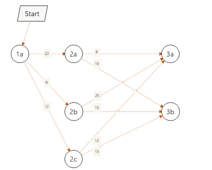

# Problem

# Graph representation

The graph data model uses the adjacency list representation. A node name points to a list wth <nodeName,cost> pairs.

Every node is looked up by two maps, its name is the key. For one of the maps the value is depth in tree. For the other map the value is a list with destination nodes and edge costs.

# Dynamic programming algorithm

V(np)=min longCost(nd)  

where

cost(nd)=shortCost(np,nd)+V(nd)
nd is in np.edges
np.depth=nd.depth-1

for (d=depthMax-1..minDepth) {

    all nodes with depth d: update V
}

